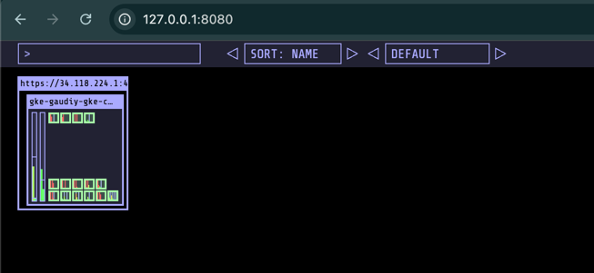

Configure kubectl  command line access by running the following command:
```bash
gcloud container clusters get-credentials gaudiy-gke-cluster --zone asia-northeast1-a --project blissful-axiom-442117-s9
```

Create monitoring namespace
```bash
kubectl create namespace monitoring
```

install kubectx
```commandline
brew install kubectx
```

Install helm
```commandline
brew install helm
```

Install kubeopsview for cluster monitoring
```commandline
helm repo add k8s-at-home https://k8s-at-home.com/charts/
helm repo update
helm install kube-ops-view k8s-at-home/kube-ops-view -f ./deployments/helm_values/kubeopsview.yaml 
export POD_NAME=$(kubectl get pods --namespace monitoring -l "app.kubernetes.io/name=kube-ops-view,app.kubernetes.io/instance=kube-ops-view" -o jsonpath="{.items[0].metadata.name}")
kubectl port-forward $POD_NAME 8080:8080
```


Setup datadog
```commandline
helm repo add datadog https://helm.datadoghq.com
helm install datadog-operator datadog/datadog-operator
kubectl create secret generic datadog-secret --from-literal api-key=***
kubectl apply -f deployments/datadog-agent.yaml
```

