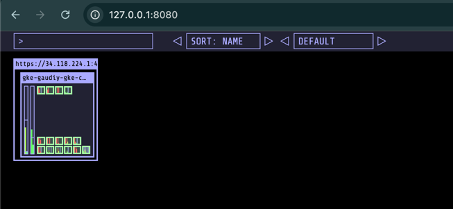

# Memos - Open Source, Self-hosted, Your Notes, Your Way (open source application used for Gaudiy assignment)


An open-source, self-hosted note-taking solution designed for seamless deployment and multi-platform access. Experience effortless plain text writing with pain-free, complemented by robust Markdown syntax support for enhanced formatting.


Here's a detailed outline for your README.md tailored for the recruitment assignment. It incorporates all the required elements and ensures clarity and comprehensiveness.

## Gaudiy Challenge Statement
Design and implement a CI/CD pipeline for a microservices-based web application hosted on GCP, ensuring scalability, monitoring, logging, automation.

## Table of Contents
1. [Implementation Overview](#implementation-overview)
2. [Architectural Diagram](#architecture)
3. [Infrastructure as Code (IaC)](#infrastructure-as-code-iac)
4. [Continuous Integration (CI)](#continuous-integration-ci)
5. [Continuous Deployment (CD)](#continuous-deployment-cd)
6. [Monitoring and Logging](#monitoring-and-logging)
7. [Security Considerations](#security-considerations)
---
<a id="implementation-overview"></a>
## Implementation Overview

* Web Application - Used a open source self-hosted note taking application developed using golang and uses mysql sqlite database.
* Infrastructure as Code - Uses Terraform provisioning tool to create and maintain GKE cluster.
* Continuous Integration & Continuous Deployment - CI/CD pipeline implemented using Github action. CI performs front & backend checks, docker image build, and deploy the code to Kubernetes cluster when merged PR to main branch.
* Docker - Created Dockerfile to build and push docker images to docker hub.
* Monitoring and logging - Datadog a cloud based monitoring solution is used to collect metrics, logs and other infrastructure telemetry data to detect and troubleshoot issues.
---
<a id="architecture"></a>
## Architectural Diagram

---
<a id='infrastructure-as-code-iac'></a>
## Infrastructure as Code

An overview of the Terraform configuration used to provision a Google Kubernetes Engine (GKE) cluster on Google Cloud Platform (GCP).

### Prerequisites
1. **Terraform**: Install Terraform (version `~> 1.5` recommended).
2. **GCP Credentials**:
   - Authenticate using `gcloud auth application-default login`.
   - Set the path to your credentials file:
     ```bash
     export GOOGLE_CLOUD_KEYFILE_JSON="path/to/your-keyfile.json"
     ```
3. Ensure the GCS bucket (sharath-gaudiy-terraform-state) exists before initializing Terraform.

### File description

`backend.tf`
This file configures Terraform's state management using Google Cloud Storage (GCS).

`provider.tf`
Defines the GCP provider and sets the project and region for resources.

`main.tf`
Creates and configures a GKE cluster.

### Deployment steps

1. Initialize Terraform:
```bash
terraform init
```

2. Plan the Deployment
```bash
terraform plan
```

3. Apply the Configuration:
```bash
terraform apply
```
---
<a id='continuous-integration-ci'></a>
## Continuous Integration (CI)

Using Github action workflow, added checks to test frontend, backend and secrets in the repository when PR is created against main branch.
This ensures the code changes that are to be merged are stable and passes the required quality checks. 
Also added docker build step, which creates docker images from the Dockerfile and pushes to dockerhub repo.

files of interest:
* .github/workflows/backend-tests.yml
* .github/workflows/frontend-tests.yml


---
## Continuous Deployment (CD)

This GitHub Actions workflow automates the Continuous Deployment (CD) process for a containerized application. 
The build-and-push-image pipeline is triggered on pushes to the main branch, ensuring seamless integration with production-ready changes.

The workflow builds docker image using `docker/build-push-action` and tags it with the commit-id for traceability.
The image is then pushed to Docker Hub, leveraging metadata for versioning.

After the the docker image is successfully built and pushed to docker hub, the deployment job is triggered.
Deployment job then deploy's the application with latest docker image to kubernetes application using `helm chart`.
"I have also made use of reusable workflow, to demonstrate reusability"

`helm upgrade --set image.tag=${{ env.DOCKER_TAG }} memos -n ${{ inputs.kubernetes_namespace }} deployments/helm_charts/memos`

Files of interest:
* .github/workflows/build-and-deploy.yml
* .github/workflows/deployment-workflow.yaml


---
<a id="monitoring-and-logging"></a>
## Monitoring and Logging

Datadog is integrated into the Kubernetes cluster to provide comprehensive monitoring, logging, and performance tracking. It ensures visibility into the cluster's health and helps identify and resolve issues proactively.
To send data to the datadog, we need to install datadog operator and datadog agent. Datadog agent is a daemon set that will be running on all the node, it collects logs and metrics and send to the datadog cloud.

### Deployment steps

Add datadog chart repo
```bash
helm repo add datadog https://helm.datadoghq.com
```

Install datadog operator
```bash
helm install datadog-operator datadog/datadog-operator
```

Create a kubernetes secret containing datadog api
```bash
kubectl create secret generic datadog-secret --from-literal api-key=***
```
Deploy datadog agent
```bash
kubectl apply -f deployments/datadog-agent.yaml
```


`Kubeopsview` is one of favourite tool that helps visualize the kubernetes cluster.
It provides a common operational picture for a Kubernetes cluster that helps with understanding our cluster setup in a visual way



files of interest:

* deployments/datadog-agent.yaml
* deployments/helm_values/kubeopsview.yaml

---
## Security Considerations

* Use GitHub Secrets to store sensitive credentials like Docker Hub tokens, GCP keys, and API keys.
* Restrict CI/CD runners to specific branches or tags to avoid unintentional pipeline executions resulting in cost increase.
* Add a secrets/credentials scanning to avoid pushing and exposing secrets.
* Use only trusted plugins or actions in the pipeline.
* Enable branch protection rules to enforce peer-reviewed merges.
* Secure storage buckets (e.g., Terraform state bucket) with appropriate IAM permissions and versioning. {pending}

---
<a id="setup-instructions"></a>
## used commands for reference

Configure kubectl  command line access by running the following command:
```bash
gcloud container clusters get-credentials gaudiy-gke-cluster --zone asia-northeast1-a --project blissful-axiom-442117-s9
```

Create monitoring namespace
```bash
kubectl create namespace monitoring
```

install kubectx
```bash
brew install kubectx
```

Install helm
```bash
brew install helm
```

Install kubeopsview for cluster monitoring
```bash
helm repo add k8s-at-home https://k8s-at-home.com/charts/
helm repo update
helm install kube-ops-view k8s-at-home/kube-ops-view -f ./deployments/helm_values/kubeopsview.yaml 
export POD_NAME=$(kubectl get pods --namespace monitoring -l "app.kubernetes.io/name=kube-ops-view,app.kubernetes.io/instance=kube-ops-view" -o jsonpath="{.items[0].metadata.name}")
kubectl port-forward $POD_NAME 8080:8080
```


Setup datadog
```bash
helm repo add datadog https://helm.datadoghq.com
helm install datadog-operator datadog/datadog-operator
kubectl create secret generic datadog-secret --from-literal api-key=***
kubectl apply -f deployments/datadog-agent.yaml
```


Deploy memos application
```bash
helm install memos -n applications deployments/helm_charts/memos
export POD_NAME=$(kubectl get pods --namespace applications -l "app.kubernetes.io/name=memos,app.kubernetes.io/instance=memos" -o jsonpath="{.items[0].metadata.name}")
export CONTAINER_PORT=$(kubectl get pod --namespace applications $POD_NAME -o jsonpath="{.spec.containers[0].ports[0].containerPort}")
kubectl --namespace applications port-forward $POD_NAME 8080:$CONTAINER_PORT
```